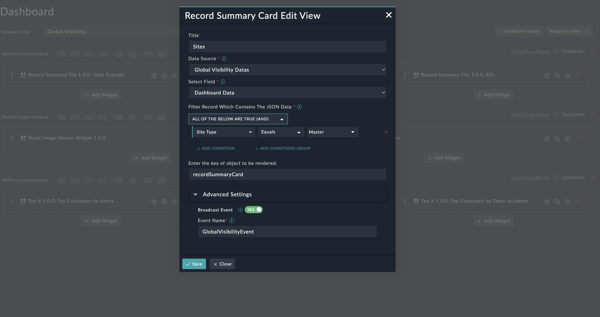

| [Home](../README.md) |
|----------------------|

# Usage

To use this widget users needs to provide a JSON in a certain format for the widget to render data.
This JSON data must be in a field of a record in a module.
This widget can also be used to *Broadcast* an event, can be enabled in advanced settings in widget configuration. 

This widget can be used as representation of an individual record, if the filter criteria filters out multiple records, and the records contain data with the required format in the field then for each record a card will be formed.

If the broadcast event is turned on, the widget will then broadcast an event passing on the record IRI(Id) to the listning widgets.

## Widget Preview and How to Use

1. Where 'data' key is present inside the JSON provided

    Edit View 

    In the field, "Enter the key of object to be rendered" contains the main key of the object "recordSummaryCard", if there is no key for the object leave the field blank.


    JSON Object which contains the data to be rendered:
    ```JSON
    "recordSummaryCard": {
      "data": {
        "MTTD": "1 min",
        "MTTR": "2 mins",
        "Node Status": "Active",
        "Active Incidents": 187,

      },
      "title": "Australia"
    }
    ```
    In this example the JSON has a key "data", "title" and value.
    
    "data" -  All the key, value pairs present in it would be rendered in the bottom section of the widget, 
    
    "title" - Value in this key would be the title for the Tile

    Record Summary Tile
    

    JSON, edit view and widget tile, when looked at simultaniously gives a clearer picture

2. Where 'data' key is not present inside the JSON provided
    

    
    In the field, "Enter the key of object to be rendered" contains the main key of the object "recordTilesROI", if there is no key for the object leave the field blank.
    JSON Object which contains the data to be rendered:
    ```JSON
    "recordTilesROI": {
      "title": "Overall Automation ROI",
      "value": "$113,122"
    }
    ```
    In this example the JSON has a key "title" and value, but no "data" key.
    So the tile will be displayed:
    
    Record Tile 


| [Installation](./setup.md#installation) | [Configuration](./setup.md#configuration) |
|-----------------------------------------|-------------------------------------------|