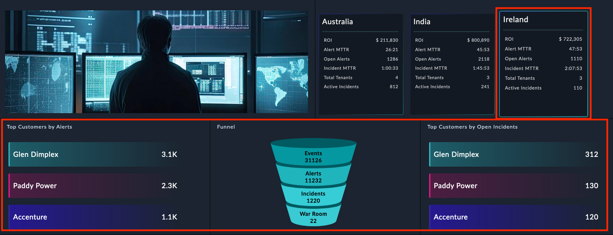

| [Home](../README.md) |
|----------------------|

# Usage

The Record Summary widget renders an information card for a record that contains JSON in a certain format. This JSON data must be in a module's record that has a field of type JSON. When multiple records meet the filter criteria, this widget renders an information card for each record.

The *Broadcast* feature in the widget configuration's [*Advanced Settings*](#advanced-settings) sends an event to the listening widgets like <em>Funnel Chart</em> and <em>Top X</em>. These widgets, which must be present on the same dashboard as the *Record Summary Card*, can be set up so that a click on a Record Summary card updates their displayed information.

<table>
    <th>IMPORTANT</th>
    <td>The <code>JSON</code> data to be rendered must have the following:
        <ul>
            <li><code>data</code> object containing data in <em>key-value</em> format</li>
            <li><code>title</code> key containing title of the card being displayed</li>
        </ul>
    </td>
</table>

### JSON Data Format

```JSON
{
    "recordSummaryCard": {
        "title": "SomeTitleForTheCard",
        "data": {
            "SomeMetric1": "SomeValue1",
            "SomeMetric2": "SomeValue2",
            "SomeMetric3": "SomeValue3",
            "SomeMetric4": "SomeValue4"
            }
    }
}
```

## Record Summary Card

1. Edit a *Dashboard*'s view template and select **Add Widget** button.

2. Select **Record Summary Card** from the list to bring up the **Record Summary Card** widget's edit view.

3. Specify the title of this visual representation in the **Title** field.

    

4. Select the module, whose records are to be displayed, in the **Select Data Source** field. The drop-down lists only those modules that support JSON data fields. For details on editing and creating modules, refer to the *Module Editor* section of the FortiSOAR *Administration Guide*, [here](https://docs.fortinet.com/document/fortisoar/7.4.1/administration-guide/97786/application-editor#Module_Editor).

    

5. Select the field, whose data is to be displayed, in the **Select Field** field. The drop-down lists fields of type `JSON`. For details on editing and creating fields, refer to the *Module Editor* section of the FortiSOAR *Administration Guide*, [here](https://docs.fortinet.com/document/fortisoar/7.4.1/administration-guide/97786/application-editor#Module_Editor).

    

6. Define the filter criteria using which to filter the data to be rendered by this widget. If multiple records meet the defined filter conditions, each record with JSON data in correct format, is rendered in its separate card of its own.

    

    <table>
        <thead>
            <th>Example</th>
        </thead>
        <tbody>
            <td>Filters can be applied for tasks like displaying the widget with only those asset records that meet the following criteria:
                <ul>
                    <li><em>Site Type</em> is <code>Master</code></li>
                </ul>
            </td>
        </tbody>
    </table>

7. Specify the JSON `key` whose `value` is to be rendered in the **Object key to render** field. The records identified through the filter conditions, in the previous step, must have the object key that contains data to be rendered.

    In the following *Example* block, the *Object key to render* is `recordSummaryCard`.

<table>
    <thead>
        <th colspan="3">Example</th>
    </thead>
    <tbody>
        <tr>
            <td colspan="3">Consider the following JSON data in one of the record's JSON field:
                <pre>"recordSummaryCard": {
                    "data": {
                        "ROI": "$ 211,830",
                        "Alert MTTR": "26:21",
                        "Open Alerts": 1286,
                        "Incident MTTR": "1:00:33",
                        "Total Tenants": 4,
                        "Active Incidents": 812
                    },
                    "title": "Australia"
                }
            </pre>
                <p>The following screenshot shows the Record Summary Card in action with this JSON data.</p>
                <p></p>
                <p>Consider the following JSON data in each of the record's JSON field:</p>
        </tr>
<tr>
    <td>
        <pre>"recordSummaryCard": {
            "data": {
            "ROI":"$37,707",
            "MTTD": "1 min",
            "MTTR": "2 mins",
            "Node Status": "Active",
            "Total Tenants":5,
            "Active Incidents": 8
            },
            "title": "Australia"
          }</pre>
    </td>
    <td>
        <pre>"recordSummaryCard": {
            "data": {
            "ROI":"$37,707",
            "MTTD": "1 min",
            "MTTR": "2 mins",
            "Node Status": "Active",
            "Total Tenants":4,
            "Active Incidents": 24
            },
            "title": "India"
          }</pre>
    </td>
    <td>
        <pre>"recordSummaryCard": {
            "data": {
            "ROI":"$37,707",
            "MTTD": "1 min",
            "MTTR": "2 mins",
            "Node Status": "Active",
            "Total Tenants":4,
            "Active Incidents": 6
            },
            "title": "Ireland"
          }</pre>
    </td>
</tr>
    </tbody>
</table>

The following screenshot shows the Record Summary Card in action with this JSON data.


### Advanced Settings

Under **Advanced Settings**, this widget can be configured to broadcast events *to listener widgets in the same dashboard*. An example of a listening widget is the **Top X** widget.

Make a note of the event name being broadcasted by the widget. Use the exact event name when configuring *Top X* and *Funnel Chart*'s event listener.

<table>
    <tr>
        <th>IMPORTANT</th>
        <td>The event listening is triggered when you click a <em>Record Summary Card</em>. The <em>Top X</em> and <em>Funnel Chart</em> widgets look for compatible JSON data in the same record that contains data for the <em>Record Summary Card</em> widget.</td>
    </tr>
</table>

___
The *Record Summary Card* widget can render and broadcast multiple JSON keys as cards. With the selection of a card the broadcasted event changes. Event listener widgets, such as *Top X*, can listen to these events and render the JSON data broadcasted by the selected card. This is helpful when managing multiple sites with varied data. Clicking a site card can generate targeted data for that site.

Following image is a side-by-side comparison of how selecting a different card, updates the associated data:

||||
|:-|:-|:-|
|Selected card *Australia*|Selected card *India*|Selected card *Ireland*|
___


These steps create an event to broadcast which can then be received by event listener widgets like *Funnel Chart* and *Top X*.

1. Click to expand **Advanced Settings**.

2. Enable the **Broadcast Event** toggle to broadcast an event.

3. Specify a name of the event, **Event Name** field, for the widget to broadcast.

    The listener widgets like *Top X* and *Funnel Chart* should be listening to exactly this event name.

<table>
    <tr>
        <th>IMPORTANT</th>
        <td><strong>Record Summary Card</strong> is a broadcasting widget. It broadcasts a record IRI listened to by widgets like <em>Funnel Chart</em> and <em>Top X</em>. However, these widgets cannot render data until the record IRI they are listening to also contains data in their compatible format.</td>
    </tr>
</table>

| [Installation](./setup.md#installation) | [Configuration](./setup.md#configuration) |
|-----------------------------------------|-------------------------------------------|